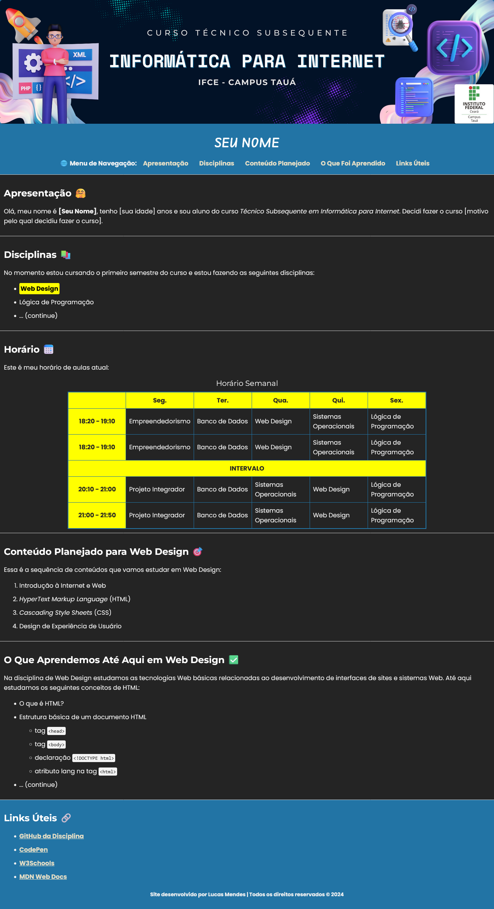

# Atividade Prática 03: CSS básico

> Esta atividade tem como objetivo integrar os conhecimentos adiquiridos até aqui na disciplina de Web Design

[Acesse aqui](./../../../materiais/slides/WEB-03-CSS_INTRO.pdf) o material sobre introdução ao CSS e tipografia para Web.
[Acesse aqui](./../../../materiais/slides/WEB-04-avancando-html) o material sobre elementos inline e block, e HTML semântico.
[Acesse aqui](https://classroom.google.com/c/NjU1Mjk5ODUyMjY3/m/NjY2MTAyMTE5MzM1/details) o material complementar sobre CSS e HTML.

## Requisitos e Instruções para Realização da Atividade

- Esta atividade tem como objetivo integrar diversos conhecimentos adiquiridos até aqui na disciplina de Web Design, como: HTML básico, HTML semântico, imagens e tabelas, elementos inline e block, CSS básico e tipografia.

- A atividade consiste em aplicar regras CSS, aprendidas em aula (cores, espaçamentos, bordas, tipografia), na página criada na [atividade 02](./../atv03/), adicionando também imagens e tabelas. O resultado deve ficar semelhante ao apresentado na imagem a seguir:

    

- **Requisitos para a avaliação:**

    - (**1 score**) Todas as estilizações referentes à **formatação básica de textos, devem ser aplicadas usando CSS**. Exemplo: ao invés de usar a tag `b` para aplicar negrito em um texto, utilize a propriedade CSS `font-weight` com o valor `bold`;
    - (**1 score**) Você deve utilizar 3 fontes diferentes:
        - uma fonte cursiva para seu nome;
        - uma fonte com ou sem serifa para os títulos das seções (que dê um destaque no título);
        - uma fonte sem serifa para o restante do texto da página.
    - (**1 score**) Pelo menos uma fonte utilizada deve ser uma fonte externa (do [Google Fonts](https://fonts.google.com/), por exemplo);
    - (**1 score**) A **estrutura da página** deve ser definida utilizando **tags semânticas** (pelo menos as tags `<header>, <main> e <footer>`). Além disso, o menu de navegação superior (links para cada seção), deve ser definido utiliando a tag semântica `<nav>`;
    - (**1 score**) Adicione o banner a seguir no topo da página, como mostrado na imagem acima, usando a tag ``:
        
    - (**1 score**) Adicione uma seção na página para organizar os horários de aula do curso em uma tabela. Estilizem a tabela de modo a destacar as células de cabeçalho/separação (como mostrado no exemplo);
    - (**1 score**) O código deve estar bem formatado/organizado e com comentários;
    - (**1 score**) Deve ser utilizado CSS externo;
    - (**1 score**) Mantenha um bom contraste visual e uma combinação hamônica entre as cores escolhidas;
    - (**3 scores**) O código final deve ser postado em seu GitHub.

- **Instruções e dicas:**
    - Sintam-se livres para utilizar outras cores, porém tentem manter um bom contraste visual e uma combinação hamônica entre as cores escolhidas. Utilizem o site [CorHexa](https://corhexa.com/verificador-contraste) para fazer a verificação de contraste e o site [Coolors.co](https://coolors.co/) para se inspirar ao escolher as cores a serem aplicadas;
    - Para consultar fontes externas, utilize o site [Google Fonts](https://fonts.google.com/);
    - Para aplicar espaçamentos, utilize as propriedades CSS `padding` (espaçamento interno) e `margin` (espaçamento externo);
    - Bordas arredondadas pode ser definidas com a propriedade `border-radius`.
