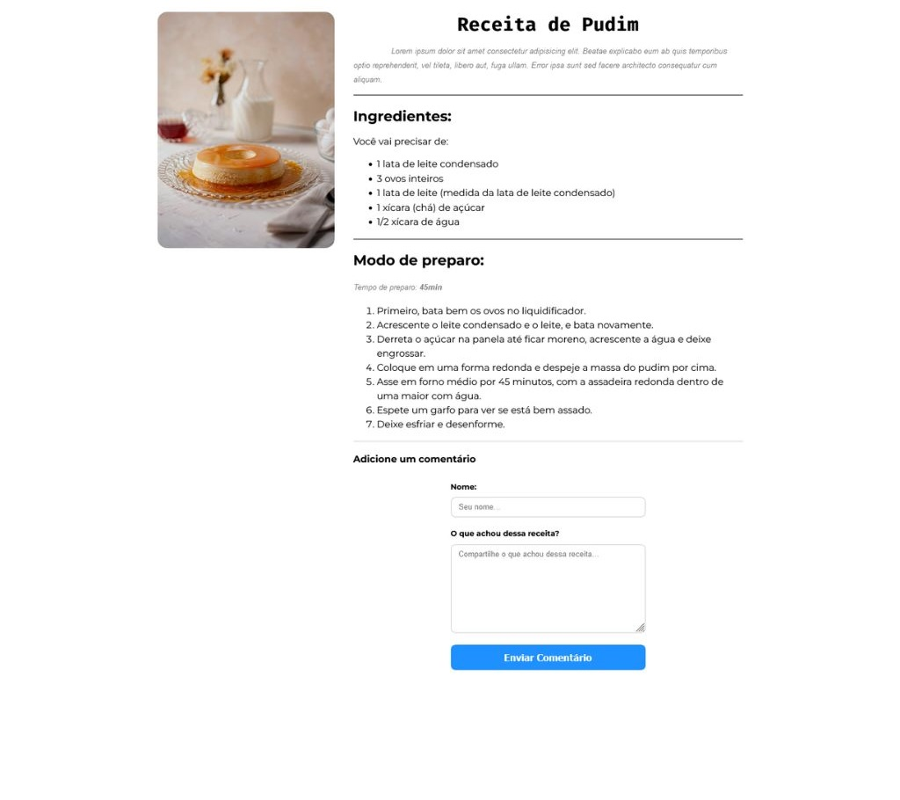
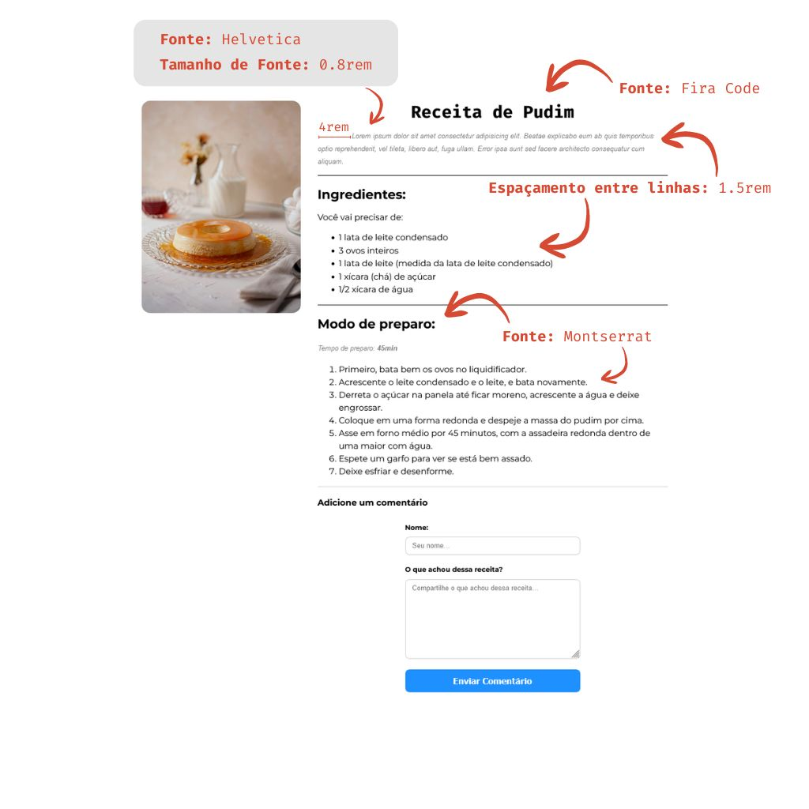
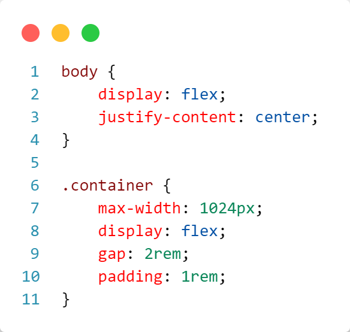

# Atividade Prática 05: Prática básica sobre tipografia, imagens e formulário

> Nesta atividade vamos trabalhar os conceitos básicos de tipografia na Web, inclusão de imagens em páginas Web e formulário HTML.

## Instruções para Realização da Atividade

- Esta atividade tem o objetivo de exercitar os conceitos básicos de tipografia na Web, inclusão de imagens em páginas Web e formulário HTML.

- A atividade consiste em construir uma página Web simples de uma receita, como exemplificado na imagem abaixo:

    

- Na imagem abaixo estão indicados os requisitos tipográficos básicos que deverão ser aplicados na resolução da atividade:

    

- **Instruções e requisitos básicos para avaliação:**

    - Defina as regras CSS necessárias para aplicar os requisitos tipográficos básicos apresentados na imagem acima;
    - Utilize o site [Google Fonts](https://fonts.google.com/) para aplicar fontes que não são padrão do sistema (no exemplo, Fira Code e Montserrat são utilizadas);
    - Utilize o código base disponível neste repositório, [nesse link](./codigo-base/). (o código base também está disponível no CodePen, [nesse link](https://codepen.io/prof_lucasmendes/pen/VwJzvoa));

    - No código base HTML, temos a seguinte estrutura no corpo (body) da página:
        
    - Essa estrutura define: um *container* (`div`) principal, onde todos os demais elementos serão inseridos; uma `div` para estruturar a imagem à esquerda, com o `id="imagem-receita"`; e uma `div` para o texto da receita à direita, com o `id="receita"`;

    - A imagem abaixo, utilizada no exemplo, está disponível neste repositório ([nesse link](./codigo-base/img/pudim.jpg)):
        

    - No código base CSS, temos as seguintes regras:
        
    - A primeira regra, aplicada ao elemento `body`, define um `display` igual a `flex` (veremos flexbox mais adiante na disciplina), e define ainda a propriedade `justify-content` (também do flexbox) igual a `center`, centralizando os elmentos horizontalmente;
    - A segunda regra, aplicada ao elemento `.container`: define uma largura máxima (`max-width`) de 1024px; aplica um espaçamento interno da borda para o conteúdo (`padding`) de `1rem`; define também um `display` igual a `flex`, fazendo com que as divs internas (`#imagem-receita e #receita`) sejam dispostas lado a lado; e define um espaçamento (`gap`) entre as divs `#imagem-receita` e `#receita` igual a `2rem`; 
    
    - **O CSS deve ser definido de forma externa**.
